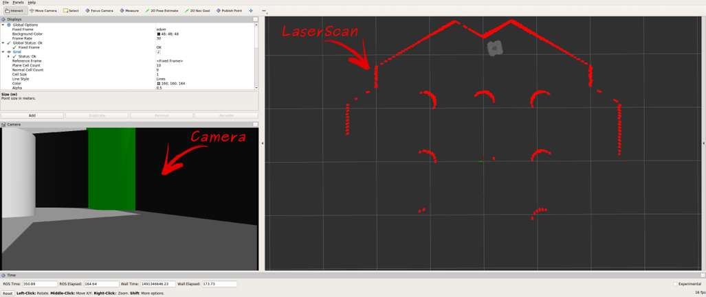
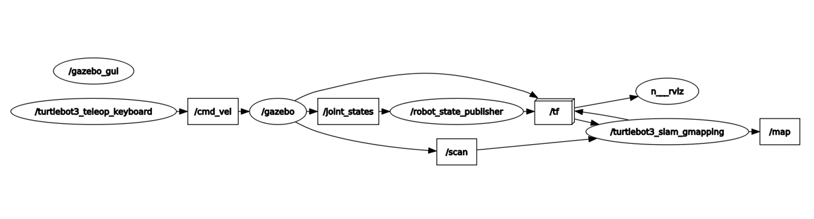

# ROS-melodic-SLAM tutorial

## Environment
* Ubuntu 18.04
* ROS-melodic
* CUDA setting : X

## Install package 
~~~
sudo apt-get install ros-melodic-joy 
sudo apt-get install ros-melodic-teleop-twist-joy
sudo apt-get install ros-melodic-teleop-twist-keyboard
sudo apt-get install ros-melodic-laser-proc
sudo apt-get install ros-melodic-rgbd-launch
sudo apt-get install ros-melodic-depthimage-to-laserscan
sudo apt-get install ros-melodic-rosserial-Arduino
sudo apt-get install ros-melodic-rosserial-python
sudo apt-get install ros-melodic-rosserial-server
sudo apt-get install ros-melodic-rosserial-client
sudo apt-get install ros-melodic-rosserial-msgs
sudo apt-get install ros-melodic-amcl
sudo apt-get install ros-melodic-map-server
sudo apt-get install ros-melodic-move-base
sudo apt-get install ros-melodic-urdf
sudo apt-get install ros-melodic-xacro
sudo apt-get install ros-melodic-compressed-image-transport
sudo apt-get install ros-melodic-rqt-image-view
sudo apt-get install ros-melodic-gmapping
sudo apt-get install ros-melodic-navigation
~~~

~~~
cd mkdir -p ~/catkin_ws/src
cd ~/catkin_ws/src/
git clone https://github.com/ROBOTIS-GIT/turtlebot3.git
git clone https://github.com/ROBOTIS-GIT/turtlebot3_msgs.git
git clone https://github.com/ROBOTIS-GIT/turtlebot3_simulations.git
cd ~/catkin_ws && catkin_make
~~~

## Driving a Virtual Robot in Gazebo

~~~
roscore
cd catkin_ws$ source devel/setup.bash
export TURTLEBOT3_MODEL=waffle_pi
roslaunchturtlebot3_gazebo turtlebot3_world.launch
~~~

* If you met following error; [Err] [REST.cc:205] Error in REST requestLibcurl: (51) SSL : no alternative certificate subject name matches target host name ‘api.ignitionfu-el.org’

~~~
gedit ~/.ignition/fuel/config.yaml
~~~
* Edit url: https://api.ignitionfuel.org ->url: https://api.ignitionrobotics.org

~~~
cd catkin_ws
source devel/setup.bash
export TURTLEBOT3_MODEL=waffle_pi
roslaunch turtlebot3_teleop turtlebot3_teleop_key.launch
~~~

~~~
cd catkin_ws
source devel/setup.bash
export TURTLEBOT3_MODEL=waffle_pi
roslaunch turtlebot3_gazebo turtlebot3_gazebo_rviz.launch
~~~

## SLAM in GAZEBO
* I recommend quit all previous window including rosecore

* execute Gazebo
~~~
cd catkin_ws
source devel/setup.bash
export TURTLEBOT3_MODEL=waffle_pi
roslaunch turtlebot3_gazebo turtlebot3_world.launch
~~~

* execute SLAM
In this case, we use gmapping that is gemeral slam package
~~~
cd catkin_ws
source devel/setup.bash
export TURTLEBOT3_MODEL=waffle_pi
roslaunch turtlebot3_slam turtlebot3_slam.launch slam_methods:=gmapping
~~~

* execute keypad
~~~
cd catkin_ws
source devel/setup.bash
export TURTLEBOT3_MODEL=waffle_pi
roslaunch turtlebot3_teleop turtlebot3_teleop_key.launch
~~~
* Map output
~~~
cd catkin_ws
source devel/setup.bas
rosrun map_server map_saver -f ~/map
~~~

## rqt_graph

## rosnode list

