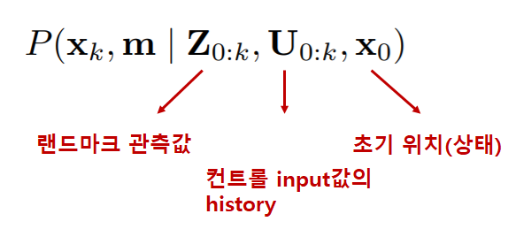
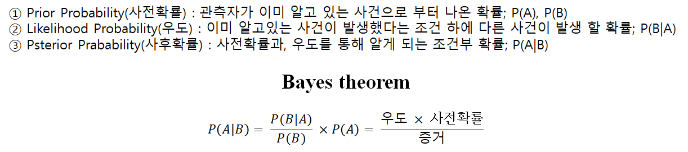

# Simultaneous Localization and Mapping;SLAM
일반적으로 자신의 위치를 알기 위해선 지도가 필요하고, 지도를 그리기 위해선 자신의 위치를 알아야 한다.
이 두가지를 동시에 알아내는 것이 바로 SLAM. 즉, x(로봇의 위치)와, m(랜드마크의 위치)를 동시에 계산하는 것이 SLAM의 해결법이다.

지금까지 많은 방법의 SLAM 들이 나왔지만, 원리를 알기위해 확률적 입장에서 SLAM을 알아보기로 한다.
먼저 설명에 필요한 정의를 해두겠다.

 : 로봇의 위치와 방향

 : 이전순간인 k-1 시점에서 의 상태가 되기위해 적용된 벡터

 : 실제위치가 안변한다고 가정되는 i번째 랜드마크의 위치를 설명하는 벡터

 : k시간에 i번째 랜드마크 위치를 로봇에서 센소로 관측한 결과(다수가 관측될 수 있음) = 추정치

### Probabilistic SLAM

위의 식은 앞서 얘기한 것들은 확률적으로 나타낸 것이다. 즉, 초기상태와, 그동안의 control, 센서로 측정한 값들의 알때, 맵과, 로봇의 위치를 확률적으로 나타낸 것이다. 정확히는 결합사후확률(joint posterior density)로 나타낸 것이다. 굳이 사후확률이라고 하는 이유는 Bayes theorem을 쓰기 위해서 이다. 위의 식에서 본 것 처럼 사후확률은 조건부확률 중 몇가지 가정을 통해 Bayes theorem을 쓸수 있는 조건부확률이라 생각하면된다. 자꾸 Bayes theorem를 말하는 이유는 복잡한 확률 계산을 몇가지 가정을 통해 간단한 곱셈 형식으로 나타낼 수 있기 때문이다.

* 참고(몰라도 됨)

