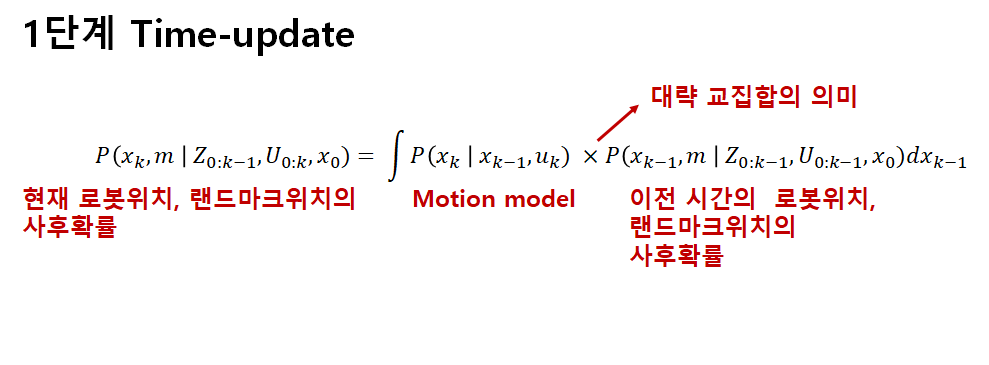
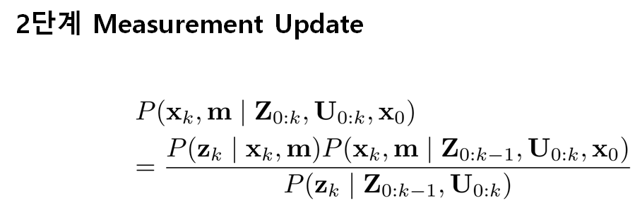
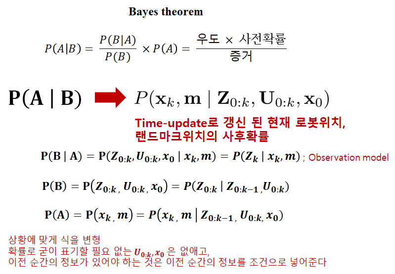

# Simultaneous Localization and Mapping;SLAM
일반적으로 자신의 위치를 알기 위해선 지도가 필요하고, 지도를 그리기 위해선 자신의 위치를 알아야 한다.
이 두가지를 동시에 알아내는 것이 바로 SLAM. 즉, x(로봇의 위치)와, m(랜드마크의 위치)를 동시에 계산하는 것이 SLAM의 해결법이다.

지금까지 많은 방법의 SLAM 들이 나왔지만, 원리를 알기위해 확률적 입장에서 SLAM을 알아보기로 한다.
먼저 설명에 필요한 정의를 해두겠다.

 : 로봇의 위치와 방향

 : 이전순간인 k-1 시점에서 의 상태가 되기위해 적용된 벡터

 : 실제위치가 안변한다고 가정되는 i번째 랜드마크의 위치를 설명하는 벡터

 : k시간에 i번째 랜드마크 위치를 로봇에서 센소로 관측한 결과(다수가 관측될 수 있음) = 추정치

### Probabilistic SLAM

위의 식은 앞서 얘기한 것들은 확률적으로 나타낸 것이다. 즉, 초기상태와, 그동안의 control, 센서로 측정한 값들의 알때, 맵과, 로봇의 위치를 확률적으로 나타낸 것이다. 정확히는 결합사후확률(joint posterior density)로 나타낸 것이다. 굳이 사후확률이라고 하는 이유는 Bayes theorem을 쓰기 위해서 이다. 위의 식에서 본 것 처럼 사후확률은 조건부확률 중 몇가지 가정을 통해 Bayes theorem을 쓸수 있는 조건부확률이라 생각하면된다. 자꾸 Bayes theorem를 말하는 이유는 복잡한 확률 계산을 몇가지 가정을 통해 간단한 곱셈 형식으로 나타낼 수 있기 때문이다.

* 참고(몰라도 됨)

그리고 추가로 

observation model : P( | , ); 로봇의 위치와 랜드마크의 위치를 알 때의 관측값의 확률분포

motion model : P( | , ); 로봇의 이전위치와, control을 알 때의 현재 위치값의 확률분포

을 정의한다.

 

이제 앞서 얘기한 위의 식을 2단계에 걸쳐 계산 할 것이며, 이는 매 단위 시간당 갱신된다.

위의 식은 Markov process라는 것인데, 시간에 따른 계의 상태변화를 다룬것이라 생각하면 된다. 주류는 위해 자세한 것은 생략...

이렇게 단위시간 마다, 로봇의 현재위치, 랜드마크의 위치가 모션모델과의 교집합적인 연산으로 보정해 간다.

드디어 앞에서 알아본 Bayes theorem을 쓸 때가 왔다. 차근차근 어떻게 적용하는 지 알아보자. 사실 이 식 자체가 Bayes theorem이다. 잘 안보일게 분명하기에 한 텀씩 써보겠다.

이렇게 Time-update에서 보정된 x,m을 센서들의 측정값을 Bayes theorem을 이용해 한번 더 보정한다. 그리고 이 연산은 매 순간 반복되며, 이를 통해 x,m의 확률분포를 좀 더 뾰족하게 만들어 준다.(정확하다는 뜻)

이런 복잡한 일련의 과정을 해결하는 두 가지 방법이 있는데 첫번째는 EKF이고, 다른 하나는 Rao-Blackwellized Filter이다. 일반적으로 대부분의 상태 표현에 있어서 가우시안 노이즈를 추가하여 모델링을 하는 경우가 많은데, EKF는 위의 SLAM의 문제를 해결하는 과정을 가우시안 노이즈를 항을 추가한 상태에서 해결 할 수 있게 해준다. Rao-Blackwellized Filter는 가우시안 확률분포를 쓰지 않고 로봇모션 모델을 묘사하여 SLAM문제를 해결하는 방식이다.

