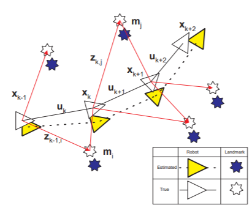

# Simultaneous Localization and Mapping;SLAM

일반적으로 자신의 위치를 알기 위해선 지도가 필요하고, 지도를 그리기 위해선 자신의 위치를 알아야 한다.
이 두가지를 동시에 알아내는 것이 바로 SLAM.
즉, x(로봇의 위치)와, m(랜드마크의 위치)를 동시에 계산하는 것이 SLAM의 해결법이다.

 : 로봇의 위치와 방향
